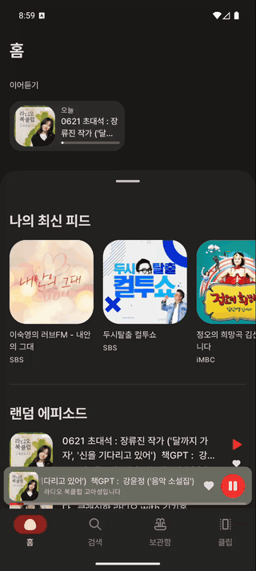
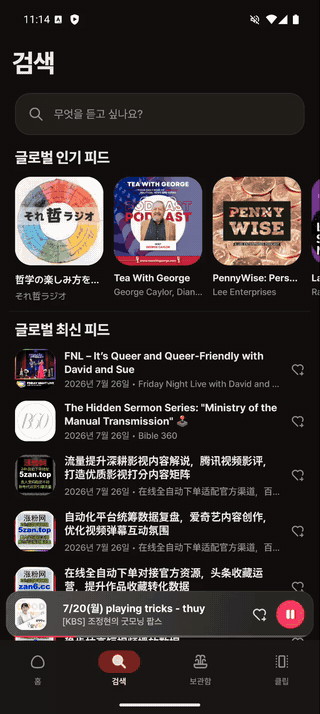
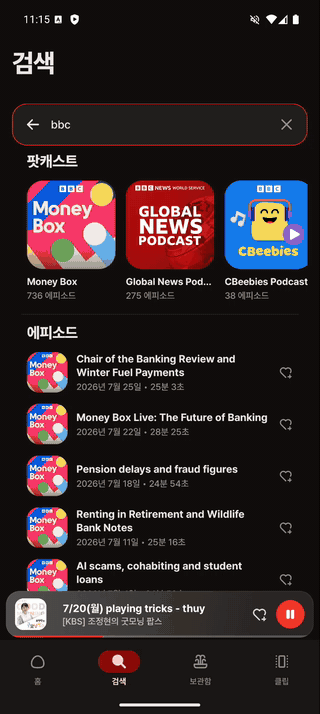
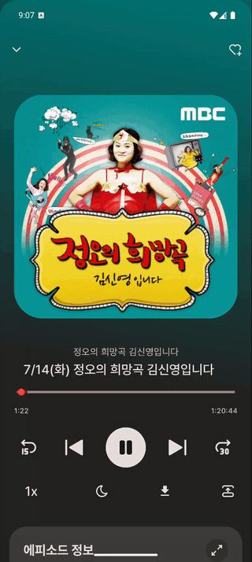
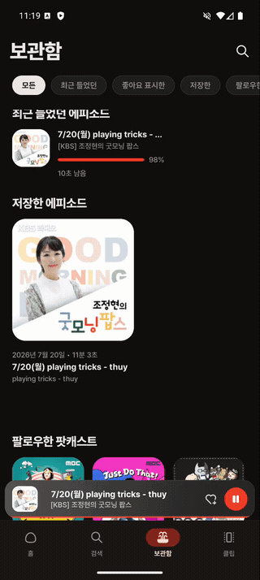
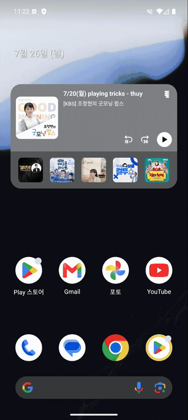

[](https://deepwiki.com/Kang-Jacob-GitLB/episodive)

# Episodive
Podcast Index Api 활용한 팟캐스트 앱

# 화면

|                     **온보딩**                     |                   **홈**                    |                    **검색**                    |                    **팟캐스트**                    |
|:----------------------------------------------:|:------------------------------------------:|:--------------------------------------------:|:----------------------------------------------:|
|  |  |  |  |
|             카테고리 선택 → 맞춤 팟캐스트 팔로우             |          최신 피드 · 랜덤/인기 · 라이브 피드          |         팟캐스트·에피소드 통합 검색 + 검색 기록         |          앨범 아트 기반 동적 테마 · 에피소드 목록          |

|                    **플레이어**                    |                    **보관함**                    |                   **클립**                   |                    **위젯**                    |
|:--------------------------------------------:|:---------------------------------------------:|:------------------------------------------:|:--------------------------------------------:|
|  |  |  |  |
|      배속 다이얼 · 슬립타이머 · ±15/30초 시킹      |        필터 칩으로 기록·좋아요·팔로우 전환        |        사운드바이트 카드 세로 스와이프 탐색        |        Glance 위젯에서 바로 재생 제어        |

> 위 GIF는 v2 디자인(2026.07) 기준으로 재촬영했습니다.

# 주요 기능

- **온보딩**: 선호 카테고리(한글 표시명 112종) 및 팟캐스트 선택으로 개인화된 경험 제공
- **홈**: 최근 재생 에피소드, 트렌딩 팟캐스트, 랜덤 에피소드, 라이브 방송 등 다양한 콘텐츠 피드 (데이터가 없는 섹션은 자동 숨김)
- **검색**: 팟캐스트 및 에피소드 검색, 최근 검색 히스토리, 최신 콘텐츠 탐색
- **라이브러리**: 구독, 좋아요, 재생 기록 등 사용자 데이터 관리
- **클립**: 사운드바이트 및 짧은 구간 미리듣기 기능
- **팟캐스트 상세**: 팟캐스트 정보 및 에피소드 목록 제공
- **오디오 플레이어**: ExoPlayer 기반의 백그라운드 재생 및 미디어 알림 지원
- **백그라운드 동기화**: WorkManager 기반 3시간 주기 에피소드 동기화 및 새 에피소드 알림
- **홈 화면 위젯**: Glance 기반 위젯으로 홈 화면에서 바로 재생 제어 및 팔로우 피드 확인
- **공유**: 에피소드는 듣던 지점과 함께, 클립은 시작 지점과 함께 공유 (팟캐스트는 웹사이트 링크)
- **Last Play**: 마지막 재생 위치 기억 및 이어듣기
- **동적 테마**: 앨범 아트에서 추출한 대표색을 플레이어·상세·미니플레이어·위젯 배경에 일관되게 적용

# 아키텍처

Episodive는 Clean Architecture와 MVI 패턴을 기반으로 구축되었습니다.

## 계층 구조

```
UI Layer (Feature Modules) - MVI Pattern
    ↓
Domain Layer (:core:domain) - Use Cases & Repository Interfaces
    ↓
Data Layer (:core:data) - Repository Implementations
    ↓
Data Sources: Network (:core:network) | Database (:core:database) | DataStore (:core:datastore)
```

## 핵심 원칙

- **MVI (Model-View-Intent)**: Intent → ViewModel → State → UI의 단방향 데이터 흐름
- **Single Source of Truth**: Room Database를 로컬 데이터의 신뢰할 수 있는 단일 소스로 활용
- **Offline First**: 네트워크 응답을 로컬 DB에 캐싱하여 오프라인 지원
- **Reactive Programming**: Kotlin Flow로 반응형 데이터 스트림 구현

# 모듈 구조

## Core Modules

| 모듈                   | 설명                                                        |
|:---------------------|:----------------------------------------------------------|
| `:core:model`        | 도메인 모델 및 데이터 클래스 (Podcast, Episode, Category, UserData 등) |
| `:core:domain`       | 비즈니스 로직 인터페이스 및 Repository 계약                             |
| `:core:data`         | Repository 구현체 (Network, Database, DataStore 조율)          |
| `:core:network`      | Retrofit 기반 Podcast Index API 통신                          |
| `:core:database`     | Room 기반 로컬 데이터베이스 (DAOs, Entities)                        |
| `:core:datastore`    | DataStore 기반 사용자 설정 관리                                    |
| `:core:player`       | ExoPlayer 기반 오디오 재생                                       |
| `:core:common`       | 공유 유틸리티 및 Hilt Qualifier (Dispatcher, Player)              |
| `:core:designsystem` | 공통 UI 컴포넌트 및 테마                                           |
| `:core:ui`           | 도메인 특화 상위 레벨 UI 컴포넌트                                      |
| `:core:testing`      | 테스트 유틸리티 및 테스트 데이터                                        |

## Feature Modules

| 모듈                    | 설명                    |
|:----------------------|:----------------------|
| `:feature:onboarding` | 온보딩 플로우 및 카테고리 선택     |
| `:feature:home`       | 홈 화면 및 다양한 팟캐스트 피드    |
| `:feature:search`     | 검색 및 탐색 기능            |
| `:feature:library`    | 사용자의 저장 및 좋아요 에피소드 관리 |
| `:feature:podcast`    | 팟캐스트 상세 정보 및 에피소드 목록  |
| `:feature:player`     | 오디오 플레이어 UI           |
| `:feature:clip`       | 사운드바이트 및 클립           |
| `:feature:channel`    | 채널/카테고리 탐색            |
| `:feature:widget`     | Glance 홈 화면 위젯          |

## App Module

| 모듈     | 설명                             |
|:-------|:-------------------------------|
| `:app` | 네비게이션 및 의존성 통합을 담당하는 메인 애플리케이션 |

# 디자인 시스템

v2 디자인(2026.07)은 **344×746 목업(1px = 1dp)** 을 기준으로 재정비했습니다. ViewModel·UseCase·Repository·Room·네트워크 로직과 MVI 시그니처는 그대로 두고 `:core:designsystem`·`:core:ui`의 표현 계층만 교체했습니다.

## 토큰

| 영역 | 내용 |
|:----|:----|
| **타이포그래피** | Pretendard 6웨이트(Light ~ ExtraBold) — Display / Headline / Title은 ExtraBold로 위계 강조 |
| **셰이프** | `EpisodiveShapes` 시맨틱 토큰 — field 14 · miniPlayer 18 · searchBar 20 · card 24 · bottomSheet 28 · playerCover 36 · heroCover 40 (dp) · pill 50% |
| **치수** | `DimensionTheme` + `LocalDimensionTheme` CompositionLocal — 목업 기준 간격·썸네일·버튼 높이를 한곳에서 관리 |
| **색상** | 다크 뉴트럴의 붉은 끼 완화, 스플래시·윈도우 배경까지 테마와 정합 |

## 동적 색상 추출

앨범 아트 대표색 추출을 `EpisodiveDominantColor` 하나로 통일했습니다(기존 홈 위젯 방식 기준).

```kotlin
object EpisodiveDominantColor {
    fun extract(bitmap: Bitmap, region: DominantRegion = DominantRegion.Full): Color?
    fun darken(argb: Int): Int
}
```

- `DominantRegion`으로 추출 영역을 지정 → 커버 비율이 다른 화면에서도 같은 색이 나옵니다
- 플레이어·팟캐스트 상세·미니플레이어·홈 위젯이 동일한 추출 결과를 공유합니다

# 기술 스택

## Android

- **Minimum SDK**: 28 (Android 9.0 Pie)
- **Target SDK**: 36 (Android 16)
- **Language**: Kotlin 2.2.21
- **UI Framework**: Jetpack Compose (BOM 2025.12.00)
- **Typography**: Pretendard (Light ~ ExtraBold 6웨이트)
- **Build**: Gradle AGP 8.13.1, KSP 2.3.1

## 핵심 라이브러리

| 카테고리 | 라이브러리 | 버전 |
|:--------|:---------|:----|
| DI | Hilt | 2.57.2 |
| Database | Room | 2.8.4 |
| Paging | Paging 3 | 3.3.6 |
| Network | Retrofit | 3.0.0 |
| Network | OkHttp | 5.3.2 |
| Network | Gson | 2.13.2 |
| Audio | Media3 (ExoPlayer) | 1.8.0 |
| Async | Kotlin Coroutines | 1.10.2 |
| Background | WorkManager | 2.10.1 |
| Image | Coil | 2.7.0 |
| Preferences | DataStore | 1.2.0 |
| UI | Material3 | 1.5.0-alpha10 |

## 테스트

| 라이브러리 | 버전 |
|:---------|:----|
| JUnit4 | 4.13.2 |
| MockK | 1.14.6 |
| Turbine | 1.2.1 |
| Robolectric | 4.16 |
| Kover | 0.9.9 |

## 빌드 시스템

- **Gradle Version Catalog**: 의존성 중앙 관리
- **Convention Plugins**: 모듈별 일관된 빌드 설정
  - `episodive.android.application` / `.application.compose` - Application 모듈
  - `episodive.android.feature` - Feature 모듈 (Compose + Hilt + Test + Kover)
  - `episodive.android.library` / `.library.compose` - 라이브러리 모듈
  - `episodive.android.room` - Room 데이터베이스 설정
  - `episodive.hilt` - Hilt DI 설정
  - `episodive.jvm.library` - 순수 JVM 라이브러리 모듈

# API 설정

이 앱은 [Podcast Index API](https://podcastindex.org/)를 사용합니다.

## API 키 설정 방법

1. [Podcast Index](https://podcastindex.org/)에서 회원가입 후 API 키 발급
2. 프로젝트 루트에 `local.properties` 파일 생성 (이미 있다면 추가)
3. 다음 내용 추가:
   ```properties
   PODCAST_INDEX_API_KEY=your_api_key
   PODCAST_INDEX_API_SECRET=your_api_secret
   ```

**주의**: `local.properties` 파일은 `.gitignore`에 포함되어 있으므로 커밋되지 않습니다.

## API 주요 엔드포인트

- `/search/byterm` - 팟캐스트 검색
- `/podcasts/trending` - 트렌딩 팟캐스트
- `/recent/feeds` - 최신 팟캐스트 피드
- `/recent/episodes` - 최신 에피소드
- `/episodes/random` - 랜덤 에피소드
- `/episodes/live` - 라이브 방송
- `/episodes/byfeedid` - 특정 팟캐스트의 에피소드

# 빌드 및 테스트

```bash
# 전체 빌드
./gradlew build

# 유닛 테스트 실행
./gradlew test
./gradlew testDebugUnitTest

# 기기 연결 테스트
./gradlew connectedAndroidTest

# 특정 모듈 테스트
./gradlew :core:database:test
./gradlew :core:data:test
./gradlew :feature:home:test

# 코드 품질
./gradlew lint
./gradlew lintFix

# 코드 커버리지 리포트 생성 (전 모듈 Kover XML)
./gradlew koverXmlReportDebug
```

# 주요 구현 패턴

## MVI (Model-View-Intent)

프레젠테이션 레이어는 MVI 패턴을 따릅니다:

```kotlin
// State - sealed interface 패턴
sealed interface SearchState {
    data object Loading : SearchState
    data class Success(val podcasts: PagingData<Podcast>) : SearchState
    data class Error(val message: String) : SearchState
}

// Action - 사용자 의도를 표현
sealed interface SearchAction {
    data class QueryChanged(val query: String) : SearchAction
    data object ClickSearch : SearchAction
    data class ClickPodcast(val podcastId: Long) : SearchAction
}

// Effect - 일회성 사이드 이펙트 (네비게이션 등)
sealed interface SearchEffect {
    data class NavigateToPodcast(val podcastId: Long) : SearchEffect
}
```

## Repository Pattern

- **Interface**: `:core:domain`에 정의된 계약
- **Implementation**: `:core:data`에서 Network, Database, DataStore 조율
- **Return Type**: Flow를 반환하여 반응형 스트림 제공

## 데이터베이스 캐싱 전략

- 모든 엔티티에 `cachedAt` 타임스탬프와 `cacheKey` 포함
- 네트워크 응답을 로컬 DB에 캐싱하여 오프라인 지원

---

## 개발 문서

- [디자인 시스템](DESIGN.md) - 색상·타이포·컴포넌트 카탈로그
- [구현 체크리스트](docs/IMPLEMENTATION_CHECKLIST.md) - 기능 구현 진행 상황
- [포트폴리오](docs/portfolio/PORTFOLIO.md) - 프로젝트 소개 슬라이드

---

## 라이선스

이 프로젝트는 개인 학습 및 포트폴리오 목적으로 제작되었습니다.