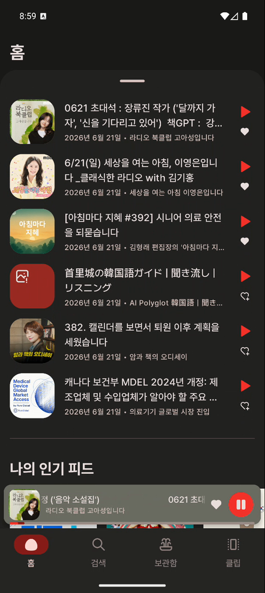
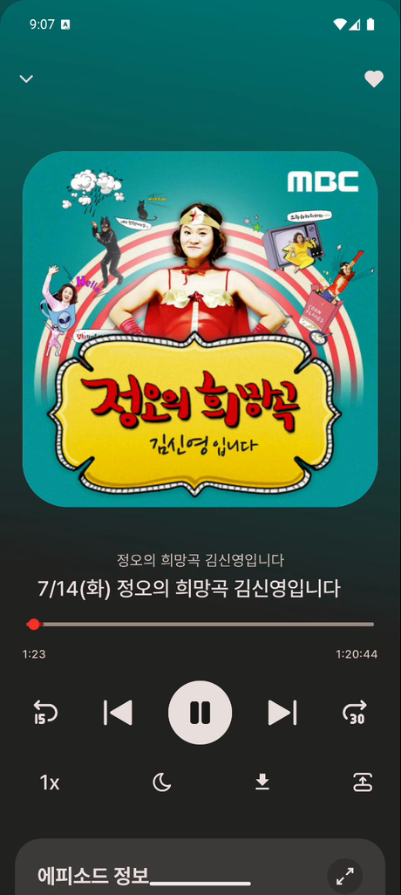
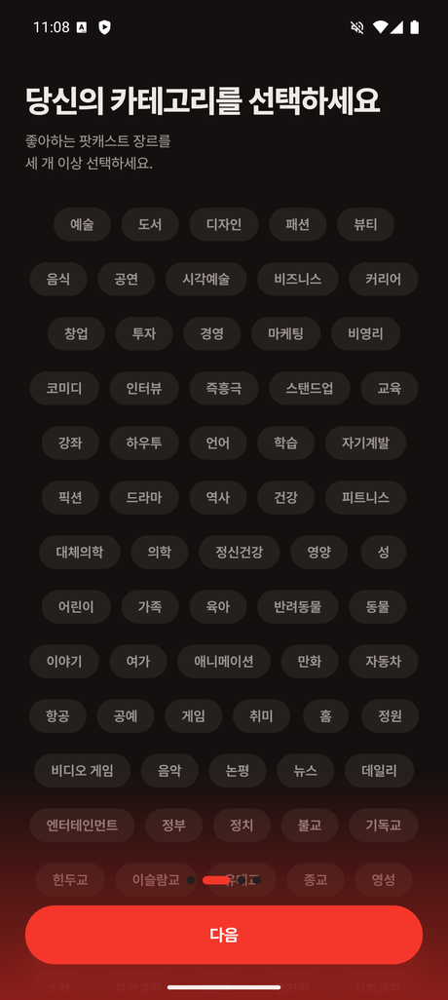
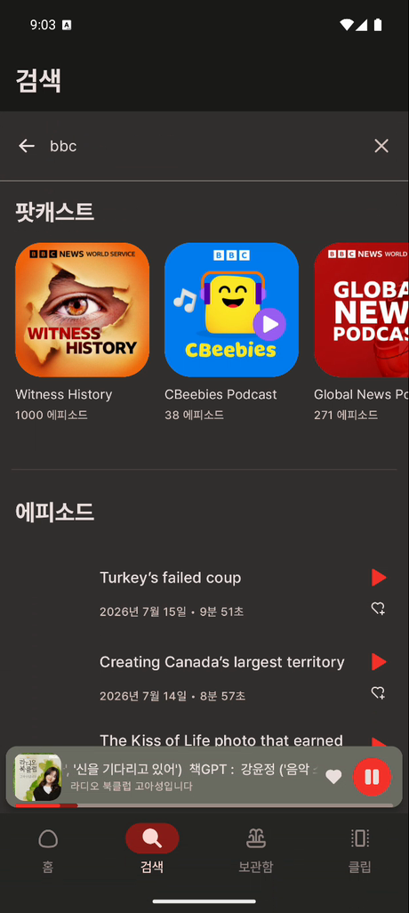
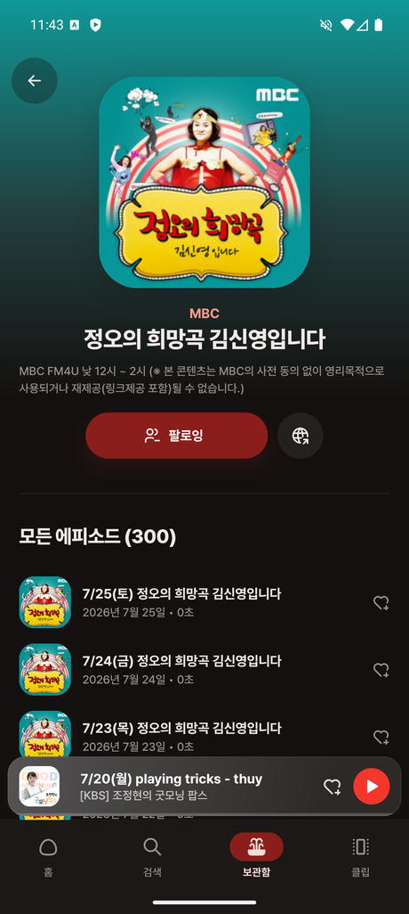
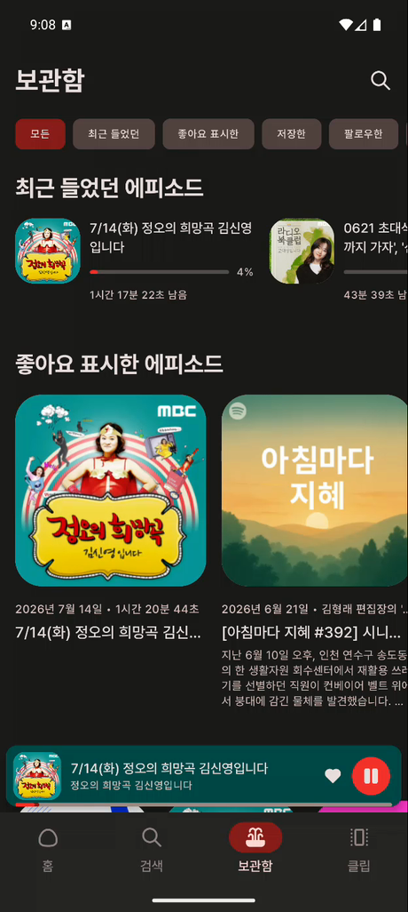
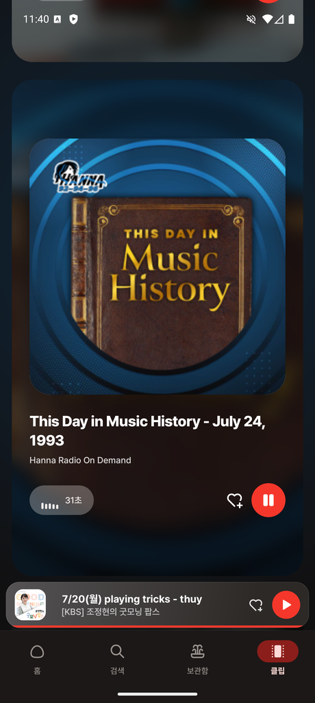
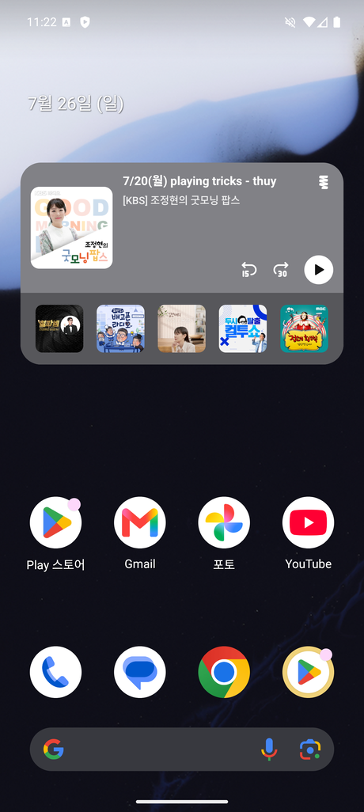

<!--class:title-->
<div class="title-left">

# Episodive<span class="dot">.</span>

<p class="tagline">Podcast Index API 기반<br>Offline-First 팟캐스트 스트리밍 앱</p>

<div class="chips">
<span>Clean Architecture</span><span>MVI</span><span>21개 멀티모듈</span><span>Jetpack Compose</span><span>Media3</span><span>Hilt</span><span>Room</span>
</div>

<div class="infocard">

| | |
|:--|:--|
| 개발 기간 | **2025.09 ~ 2026.07** (약 10개월) |
| 인원 / 역할 | **1인 개발** — 기획·설계·구현·테스트 전 과정 |
| 플랫폼 | Android 9.0(API 28) ~ Android 16(API 36) |

</div>
</div>
<div class="title-right">


</div>

---

<!--class:content-->

## 1. 프로젝트 개요

**Episodive**는 [Podcast Index API](https://podcastindex.org/)로 전 세계 팟캐스트를 검색·구독·재생하는 Android 앱입니다. 개인화 온보딩부터 백그라운드 오디오 재생, 오프라인 다운로드, 홈 화면 위젯까지 **실사용 가능한 완결형 미디어 앱**을 목표로, Google의 최신 아키텍처 가이드(Now in Android)를 실전 규모로 적용했습니다.

단순 API 연동 토이 프로젝트를 넘어 **멀티모듈 구조 · 오프라인 우선 캐싱 · 미디어 세션 · 프레임 단위 UX 디버깅**까지, 프로덕션 앱에서 마주치는 문제를 직접 설계하고 해결했습니다.

| 항목 | 수치 |
|:--|:--|
| 모듈 수 | **21개** (Core 11 · Feature 9 · App 1) |
| 코드 규모 | Kotlin **510개 파일 · 약 53,600줄** |
| 커밋 | **81개** (feat 39 · fix 16 · refactor 7 · test 6 · docs 6) |
| 테스트 커버리지 | **라인 81.7%** (2026.03 기준, 모듈별 최대 100%) |
| 컨벤션 플러그인 | **12개** (Gradle build-logic 빌드 표준화) |

---

<!--class:screens-->

## 2. 주요 화면 (1/2)

| 온보딩 | 홈 | 검색 | 팟캐스트 상세 |
|:--:|:--:|:--:|:--:|
|  |  |  |  |
| 카테고리 선택 → 맞춤 팟캐스트 추천·팔로우 | 이어듣기 · 팔로우 피드 · 랜덤/트렌딩 | 팟캐스트·에피소드 통합 검색 + 히스토리 | 앨범 아트 기반 동적 테마 · 에피소드 목록 |

---

<!--class:screens-->

## 2. 주요 화면 (2/2)

| 플레이어 | 보관함 | 클립 | 홈 화면 위젯 |
|:--:|:--:|:--:|:--:|
|  |  |  |  |
| 배속 · 슬립타이머 · 다운로드 · ±15/30초 | 최근 들었던 · 좋아요 · 팔로우 필터 | 사운드바이트 카드 스와이프 탐색 | Glance 위젯에서 바로 재생 제어 |

---

<!--class:content-->

## 3. 기술 스택

| 영역 | 기술 |
|:--|:--|
| **언어 / UI** | Kotlin 2.2 · Jetpack Compose (Material3) |
| **아키텍처** | Clean Architecture · MVI · 멀티모듈 · Offline-First |
| **비동기** | Coroutines · Flow · StateFlow / SharedFlow |
| **DI** | Hilt (+ Hilt Worker, qualifier 기반 듀얼 플레이어) |
| **로컬 DB** | Room 2.8 (Entity 12 · View 2 · DAO 5 · FTS · Auto-migration v8) |
| **네트워크** | Retrofit · OkHttp (SHA-1 인증 Interceptor) · Gson |
| **미디어** | Media3 ExoPlayer · MediaSession · MediaNotificationService |
| **페이징 / 이미지** | Paging 3 · Coil (+ Palette 동적 색상 추출) |
| **백그라운드 / 위젯** | WorkManager (주기 동기화) · Glance (홈 위젯) |
| **테스트 / 빌드** | JUnit4 · MockK · Turbine · Robolectric · Kover · Gradle Convention Plugin |

---

<!--class:arch-->

## 4. 아키텍처

<div class="arch-stack">
<div class="arch-layer"><b>UI Layer</b><span>Feature 모듈 9개 · MVI (State / Action / Effect)</span></div>
<div class="arch-layer"><b>Domain Layer</b><span>:core:domain · Repository 인터페이스 · 40+ UseCase</span></div>
<div class="arch-layer"><b>Data Layer</b><span>:core:data · Repository 구현 · RemoteUpdater</span></div>
<div class="arch-layer"><b>Data Source</b><span>Network · Database(Room) · DataStore</span></div>
<div class="arch-note">단방향 의존성 &nbsp; UI → Domain → Data &nbsp; (상위 계층은 하위 구현을 모르고 인터페이스에만 의존)</div>
</div>

- **MVI 패턴** — 모든 Feature가 `State(sealed interface)` · `Action` · `Effect(SharedFlow)`로 단방향 데이터 흐름을 강제
- **Single Source of Truth** — 네트워크 응답을 Room에 저장하고 UI는 항상 **DB의 Flow**만 구독
- **멀티모듈 표준화** — 21개 모듈을 **12개 컨벤션 플러그인**으로 통일, 새 Feature는 `episodive.android.feature` 한 줄로 Compose·Hilt·Test·Kover 자동 적용

---

<!--class:content-->

## 5. 핵심 구현 — Offline-First 캐싱

네트워크·DB 조율 로직의 중복을 제거하기 위해 캐시 갱신 흐름을 **제네릭 추상 클래스 `RemoteUpdater`** 로 추출했습니다. `onStart`에서 만료 여부를 검사해 필요할 때만 원격을 호출하고, UI에는 **항상 DB 스트림**을 반환합니다.

```kotlin
abstract class RemoteUpdater<Query : CacheableQuery, Response, Entity, Output : Any>(
    protected open val query: Query,
) {
    protected abstract suspend fun fetchFromRemote(fetchSize: Int = 1000): List<Response>
    protected abstract suspend fun convertToEntity(responses: List<Response>): List<Entity>
    protected abstract suspend fun replaceToLocal(entities: List<Entity>)
    protected abstract suspend fun isExpired(): Boolean

    fun getFlowList(count: Int): Flow<List<Output>> =
        getFlowSource(count).onStart { refreshIfNeeded() }   // 단일 소스 = DB
    private suspend fun refreshIfNeeded() { if (isExpired()) refresh() }
}
```

- 모든 Entity에 `cachedAt` + 그룹 키를 두어 **TTL 기반 캐시 무효화** · Trending/Recommended/Random/Recent 쿼리별 TTL 분리
- Flow / PagingData 두 진입점을 동일 패턴으로 커버 → **오프라인에서도 즉시 렌더링**

---

<!--class:cards-->

## 6. 핵심 구현 — 미디어 & 위젯

| | |
|:--|:--|
| **듀얼 ExoPlayer + MediaSession**<br>Hilt `@Player` qualifier로 본 재생(Main)과 클립 미리듣기(Clip) 인스턴스를 분리. `MediaNotificationService`로 백그라운드 재생·미디어 알림·Last Play(이어듣기) 구현 | **Palette 동적 테마**<br>앨범 아트에서 대표 색을 1회 single-pass 추출해 플레이어·상세·미니플레이어·위젯 배경을 통일. 콘텐츠마다 화면 색이 살아 움직임 |
| **Glance 홈 화면 위젯**<br>Compose for Widgets로 Now Playing + "나의 최신 피드"를 홈에서 제어. `WidgetDispatcher` Strategy로 역의존성 차단, 250ms debounce로 과도 갱신 억제 | **백그라운드 동기화**<br>WorkManager + Hilt Worker로 3시간 주기 새 에피소드 확인. Coil로 썸네일을 Bitmap 변환해 `setLargeIcon` 알림 전달 |

---

<!--class:content-->

## 7. 문제 해결 · CASE 1 — 스크롤 fling 움찔거림 제거 <span class="tag">#79</span>

**증상** — 홈 시트 리스트·가로 캐러셀·전체 플레이어에서 스크롤이 멈추는 순간 콘텐츠가 반대 방향으로 튕김.

**원인 분석** — 리스트 콘텐츠가 뷰포트보다 짧아 스크롤이 대부분 **가장자리에서 종료**되는데, 이때 fling 잔여 속도가 Compose 오버스크롤 **stretch 애니메이션**을 유발. 프레임·로그 분석으로 *"시트/스크롤 오프셋은 불변, nested scroll은 원인 아님"* 을 확인하고 stretch로 범위를 좁힘.

**해결** — 문제가 되는 `LazyColumn`/캐러셀에서만 오버스크롤 효과를 제거하되, **시트 collapse · 스와이프 다운 dismiss · 캐러셀 snap** 동작은 그대로 보존.

**검증** — 수정 전: fling 종료 후 10–14프레임(약 200ms) 동안 8–15px 역방향 드리프트 → 수정 후 **가장자리 완전 정지** (에뮬레이터 프레임 캡처 비교로 정량 확인).

---

<!--class:content-->

## 8. 문제 해결 · CASE 2 — 오프라인 재생 & 다운로드 상태 견고화 <span class="tag">#77 #78</span>

**증상** — 다운로드를 완료해도 항상 스트리밍 URL로 재생되어 **오프라인 재생이 동작하지 않았고**, 다운로드 아이콘이 누르자마자 완료로 바뀌거나 완료 후 무한 스피너로 남는 등 상태 표시가 불안정.

**원인 분석** — 다운로드 진행/완료 상태의 진실의 원천이 *DB + BroadcastReceiver* 에 흩어져 실제 시스템 상태와 어긋났고, 재생 경로가 저장된 로컬 파일(`filePath`)을 사용하지 않음.

**해결**

- 상태의 진실의 원천을 **시스템 `DownloadManager` 직접 조회**로 일원화 · 활성 다운로드가 있을 때만 폴링하고 조회 예외를 방어
- 상대경로 `filePath`("feedId/id.ext")를 다운로드 디렉토리 기준 **절대경로**로 변환해 재생에 사용

**검증** — 에뮬레이터 **에어플레인 모드**에서 다운로드 에피소드 재생 성공, 미저장 → 다운로드 중 → 완료 아이콘 전환을 end-to-end로 확인.

---

<!--class:content-->

## 9. 문제 해결 · CASE 3 — 온보딩 Paging 상태 분리 <span class="tag">#80</span>

**증상** — 온보딩 채널 선택 화면에서 팔로우 버튼을 누를 때마다 리스트가 처음부터 다시 로드되어 스크롤 위치가 튀고 항목 순서가 바뀜.

**원인 분석** — 팔로우 여부(`isFollowed`)를 **PagingData 아이템 안에** 담아, 팔로우가 바뀔 때마다 Paging 스트림 전체가 새로 방출됨.

**해결** — 팔로우 상태를 `GetFollowedPodcastsUseCase` 기반 **별도 `followedPodcastIds` Flow로 분리**해, PagingData는 그대로 두고 체크 표시만 즉시 갱신하도록 재설계.

**검증** — 리스트 하단까지 스크롤한 뒤 토글해도 **스크롤 위치·순서 유지**, 팔로우만 반영됨을 재현 검증.

> Paging 스트림과 사용자 상태를 분리해 리스트 안정성과 즉각적 피드백을 동시에 확보.

---

<!--class:content-->

## 10. 테스트 & 품질

**전체 라인 커버리지 81.7%** (2026.03 기준) — 도메인·데이터·프레젠테이션 로직을 폭넓게 검증했습니다.

| 모듈 | 라인 커버리지 | | 모듈 | 라인 커버리지 |
|:--|:--:|:--|:--|:--:|
| feature:clip | **100.0%** | | core:domain | 87.7% |
| feature:channel | 98.0% | | core:data | 87.2% |
| feature:home | 95.7% | | core:network | 87.2% |
| feature:onboarding | 95.5% | | feature:search | 93.7% |

- **Turbine**으로 Flow / StateFlow 방출 순서 검증, **MockK**로 UseCase·Repository 격리
- **Robolectric + RoomDatabaseRule**로 DAO·마이그레이션 검증, 테스트 데이터 팩토리로 일관된 픽스처 사용
- Kover 커버리지 리포트를 **CI 뱃지로 자동 게시**

---

<!--class:closing-->

## 강조하고 싶은 점

<div class="closing-grid">

**1. 최신 안드로이드 아키텍처의 실전 적용**
Now in Android급 멀티모듈·컨벤션 플러그인·Offline-First를 21개 모듈 규모로 직접 설계.

**2. 미디어 도메인 깊이**
Media3 · MediaSession · 백그라운드 재생 · 다운로드/오프라인 · Glance 위젯까지 미디어 앱의 핵심 난제를 커버.

**3. UX를 프레임 단위로 디버깅**
스크롤 움찔거림·상태 깜빡임 같은 미묘한 결함을 정량 측정하고 근본 원인부터 수정.

**4. 품질에 대한 태도**
81.7% 테스트 커버리지, 커밋마다 문제·원인·해결·검증을 기록하는 습관.

</div>

<p class="thanks">데모 GIF · 전체 소스는 저장소에서 확인할 수 있습니다. &nbsp;— &nbsp;<strong>감사합니다.</strong></p>
